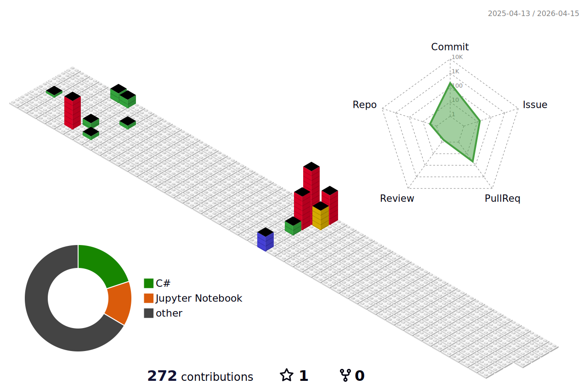

<!-- Background -->

<!-- Typograssy -->

<!-- About Me -->
##  **About Me**
Hi, I'm **Shintaro Niwamoto**, a systems and ML engineer passionate about creating scalable, practical, and elegant solutions.  
I enjoy working with low-level systems, ML models, and tools that make engineers more productive.  
I love blending creativity with technology — and this page is a little showcase of that.

<!-- Tech Stack -->
##  **Tech Stack**

## 🧰 Tech Stack (Badges)

### 📝 Languages

### 📚 Frameworks & Libraries

### 🛠️ Tools & DevOps

### 🗄️ Database

### 🌐 Web Fundamentals

### 🤝 AI Coding Assistants

### 🖥️ Compute (GPU)

<!-- GitHub Analytics -->
##  **GitHub Analytics**

  <!-- 左：GitHub Readme Stats -->
  
  <!-- 右：3D Contrib -->
  

<!-- Contact -->
##  **Contact**

Feel free to reach out or connect through any of the platforms below👇  

<!-- Contact & Profiles -->

**Feel free to reach out — ⬇︎各バッジをクリックするとプロフィール/連絡先へ飛びます**

### 📇 Contact & Profiles

<!-- 1段目：連絡手段＋汎用 -->

  
  
  
  

<!-- 2段目：技術ブログ系 -->

  
  
  

<!-- Footer -->

  **⭐ From [shin1300](https://github.com/shin1300) with ❤️**

<!--
Third-party assets used (all MIT):
- GitHub Profile 3D Contrib — https://github.com/yoshi389111/github-profile-3d-contrib
- Capsule Render — https://github.com/kyechan99/capsule-render
- Readme Typing SVG — https://github.com/DenverCoder1/readme-typing-svg
- Microsoft Fluent Emoji (Animated) — https://github.com/microsoft/fluentui-emoji
-->
