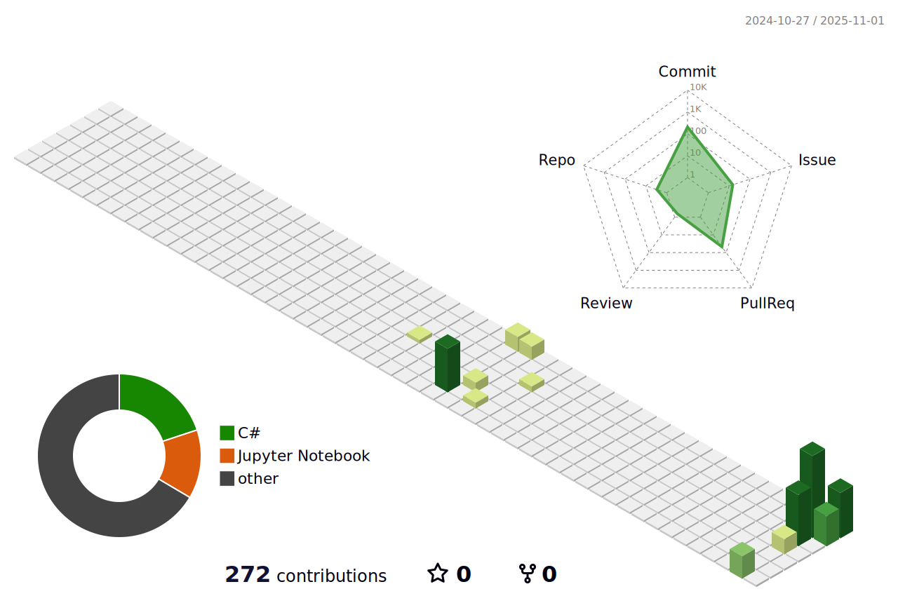

<!-- Background -->

<!-- Typograssy -->

<!-- About Me -->
##  **About Me**
Hi, I'm **Shintaro Niwamoto**, a systems and ML engineer passionate about creating scalable, practical, and elegant solutions.  
I enjoy working with low-level systems, ML models, and tools that make engineers more productive.  
I love blending creativity with technology — and this page is a little showcase of that.

<!-- Tech Stack -->
##  **Tech Stack**

  <!-- Systems / Android -->
  <h3>🧩 <b>Systems / Android</b></h3>
  

  <!-- ML / Generative -->
  <h3>🤖 <b>ML / Generative</b></h3>
  

  <!-- Tools -->
  <h3>🔧 <b>Tools</b></h3>
  

  <!-- Web Basics（Toolsの下へ移動） -->
  <h3>💻 <b>Web Basics</b></h3>
  

<!-- GitHub Analytics -->
##  **GitHub Analytics**

  <!-- 左：GitHub Readme Stats -->
  
  <!-- 右：3D Contrib -->
  

<!-- Contact -->
##  **Contact**

Feel free to reach out or connect through any of the platforms below👇  

  ✉️ **Mail:** shintaro.niwamoto@ubi-lab.com  
  🐦 **X (Twitter):** ubishin130  
  🧮 **AtCoder:** ubishin  
  🧠 **Kaggle:** shinta120  
  📝 **Qiita:** shin1300  
  🌱 **Zenn:** ubishin  
  🗒️ **Note:** ubishin

<!-- Footer -->

  **⭐ From [shin1300](https://github.com/shin1300) with ❤️**

<!--
Third-party assets used (all MIT):
- GitHub Profile 3D Contrib — https://github.com/yoshi389111/github-profile-3d-contrib
- Capsule Render — https://github.com/kyechan99/capsule-render
- Readme Typing SVG — https://github.com/DenverCoder1/readme-typing-svg
- Microsoft Fluent Emoji (Animated) — https://github.com/microsoft/fluentui-emoji
-->
