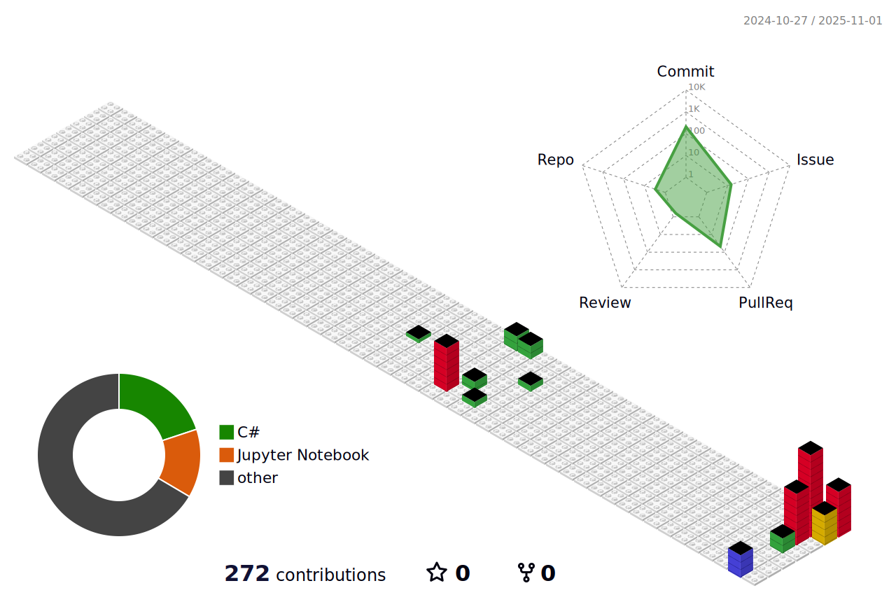

<!-- ====================================================== -->
<!-- Hero / Title / Quick Links (centered like Lobe Theme)  -->
<!-- ====================================================== -->

  

  <h1>
    Shintaro Niwamoto 
  </h1>

  <!-- Typograssy (centered) -->
  

<!-- ================================== -->
<!-- Cute-numbered Table of Contents    -->
<!-- ================================== -->

**Table of Contents**

<a href="#-about-me">⓵ About</a> &nbsp;•&nbsp;
<a href="#-tech-stack">⓶ Tech Stack</a> &nbsp;•&nbsp;
<a href="#-github-analytics">⓷ Analytics</a> &nbsp;•&nbsp;
<a href="#-contact--profiles">⓸ Contact</a>

---

<!-- ======== -->
<!-- About Me -->
<!-- ======== -->
##  **About Me**

 Hi, I'm **Shintaro Niwamoto**, a first-year master's student at Nara Institute of Science and Technology (NAIST).  
I work in ubiquitous computing, designing and implementing systems that seamlessly integrate with the real world.  
 My research interests include **LLMs**, **digital twins**, **text-to-motion**, and **sensing technologies**.
 I love exploring new technologies. One of my favorite quotes is:
> “**The best error message is the one that never shows up.**” 
(You’ll also find it flowing through my Typograssy banner!)

<!-- =========== -->
<!-- Tech Stack  -->
<!-- =========== -->
##  **Tech Stack**

Here’s the **tech stack** I use in my daily research and development.

  
    

  
    

  
    

  

<!-- ================= -->
<!-- GitHub Analytics  -->
<!-- ================= -->
##  **GitHub Analytics**

A snapshot of my activity.  
Feel free to explore **the repositories** and recent commits!

  

  

 

<!-- ===================== -->
<!-- Contact & Profiles    -->
<!-- ===================== -->
##  **Contact & Profiles**

Questions, ideas, or just want to chat?  
Feel free to reach out — just **tap the icons below** 👇

<ul style="list-style:none; padding-left:0;">
  <li>
    
  </li>
  <li>
    
  </li>
  <li>
    
  </li>
  <li>
    
  </li>
  <li>
    
  </li>
  <li>
    
  </li>
  <li>
    
  </li>
</ul>

---

> © 2025 Shintaro Niwamoto — MIT License for third-party assets. See [ATTRIBUTIONS.md](./ATTRIBUTIONS.md) for details.
